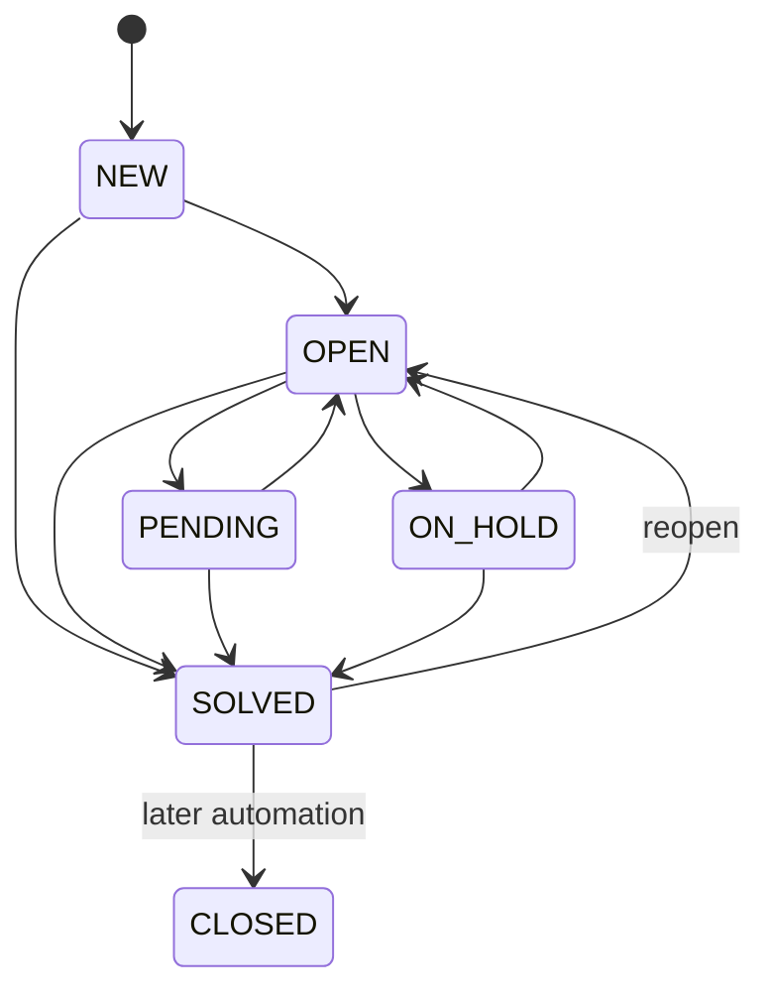

# MVP PRD

Status: Baseline v0.3
Scope: Core MVP + Portfolio Release Gate

## 1. Scope statement

MVP는 고객 문의 접수부터 상담 종료와 내부 협업까지의 핵심 업무 흐름을 완성한다. 동시에 이후 외부 API와 보안 감사를 붙일 수 있도록 actor/source/idempotency/audit 기반을 실제 데이터 모델과 명령 경계에 포함한다.

외부 API·SDK·webhook의 전체 구현은 Core MVP 뒤에 진행하지만, staff의 티켓 상세 조회와 검색 기록, 전체 티켓 변경 조회는 첫 포트폴리오 릴리스에 포함한다. 이 기능은 나중에 controller logging으로 덧붙이는 부가 기능이 아니라 제품 요구사항이다.

## 2. Customer access modes

관리자 설정 `customerAccessMode`는 장기적으로 다음 값을 가진다.

| Mode | Submit | View/reply | Initial status |
|---|---|---|---|
| `ANONYMOUS_ALLOWED` | 이름/이메일 | 이메일 검증 또는 조회 키 | Core MVP |
| `REGISTRATION_OPTIONAL` | 익명 또는 로그인 | 로그인 시 과거 문의 연결 | Post-MVP |
| `REGISTRATION_REQUIRED` | 로그인 필수 | 로그인 세션 | Post-MVP |

`Customer`와 `CustomerAccount`를 분리한다. 같은 이메일을 입력했다는 이유만으로 익명 사용자에게 과거 문의를 보여주지 않는다.

## 3. Ticket representation

- `Ticket`에는 `description` 필드가 없다.
- 고객 웹 문의의 `message`는 티켓 생성과 같은 트랜잭션에서 첫 `PUBLIC` `TicketComment`로 저장한다.
- 상담사가 고객 문의 없이 직접 만든 내부 티켓은 첫 코멘트가 `INTERNAL`일 수 있다.
- 고객에게 보이는 대화는 `PUBLIC` 코멘트의 시간순 목록이다.
- `INTERNAL` 코멘트는 staff projection에서만 조회한다.
- 코멘트는 MVP에서 append-only다.

## 4. Ticket states



- `NEW`: 아직 실질 처리 전
- `OPEN`: 상담사가 처리 중
- `PENDING`: 고객의 답변 또는 행동을 기다림
- `ON_HOLD`: 내부·외부 처리 결과를 기다림
- `SOLVED`: 상담상 해결됨. 재오픈 가능
- `CLOSED`: 장기적으로 자동 전환되는 최종 상태

## 5. Priorities

`LOW`, `NORMAL`, `HIGH`, `URGENT`. 기본값은 `NORMAL`이다.

## 6. Actor and source requirements

모든 명령과 민감한 조회는 다음 context를 가진다.

```text
ActorRef
  actorType: CUSTOMER | STAFF | INTEGRATION_CLIENT | TRIGGER | AUTOMATION | SYSTEM
  actorId
  displayNameSnapshot
  impersonatedByActorId?

RequestContext
  source: CUSTOMER_PORTAL | AGENT_UI | ADMIN_UI | PUBLIC_API | TRIGGER | AUTOMATION | SYSTEM_JOB
  requestId
  correlationId
  commandId?
  integrationClientId?
  ipAddress?
  userAgent?
```

- 티켓 변경 audit에는 actor/source/command/correlation을 반드시 저장한다.
- API client가 staff user를 임의로 가장할 수 없다.
- 나중에 delegated OAuth를 지원할 경우 `actor=STAFF`, `clientId=...`를 모두 저장한다.
- trigger/automation은 실행 definition ID와 version을 저장한다.

## 7. Core workflows and acceptance criteria

### M1 — Anonymous request and customer view

**Submit**

- 이름, 이메일, 제목, 문의 내용은 필수다.
- 이메일은 비교용 normalized 값을 별도로 저장한다.
- 문의 생성 시 Customer, Ticket, 첫 공개 코멘트, change audit, 조회 토큰이 원자적으로 생성된다.
- 응답은 사람용 티켓 번호와 한 번만 표시되는 조회 키를 반환한다.
- DB에는 조회 키 원문을 저장하지 않는다.
- 첫 change audit은 `TICKET_CREATED`, `COMMENT_CREATED` events를 순서대로 가진다.

**View**

- 티켓 번호와 유효한 조회 수단이 필요하다.
- 응답에는 공개 코멘트만 포함한다.
- 잘못된 번호·토큰 조합은 동일한 404로 응답한다.
- customer access는 staff access log 대상이 아니다. 별도의 customer security event 정책은 post-MVP에서 결정한다.

### M2 — Staff identity, group, workspace

- `ADMIN`, `AGENT`, `SECURITY_AUDITOR` 역할로 로그인한다.
- 역할은 독립 capability로 확장 가능하게 설계한다.
- 티켓 목록은 상태, 우선순위, 그룹, 담당자, 업데이트 시각을 보여준다.
- 티켓 상세는 고객 정보, 공개 대화, 내부 메모, 상태/우선순위/그룹/담당자, 관계, audit timeline을 보여준다.
- 상담사는 `PUBLIC` 답변과 `INTERNAL` 메모 중 하나를 명시적으로 선택한다.
- 상세 projection을 성공적으로 반환하면 `TICKET_DETAIL_ACCESSED` access event를 남긴다.

### M3 — Atomic update and ticket change audit

상담사가 한 번의 저장으로 다음을 함께 수행할 수 있다.

- 코멘트 추가
- 상태 변경
- 우선순위 변경
- 그룹 변경
- 담당자 변경

한 번의 저장은 하나의 `TicketChangeAudit`을 만들고 순서 있는 events를 담는다.

Audit event의 최소 필드:

```text
eventType
fieldName?
beforeValue?
afterValue?
commentId?
visibility?
sequence
```

- no-op 변경은 event를 만들지 않는다.
- change audit 기록이 실패하면 티켓 변경도 롤백한다.
- 현재 Ticket row가 현재 상태 source of truth다.
- audit은 Event Sourcing 저장소가 아니다.

### M4 — Assignment and transfer

- 상담사 간 이관과 그룹 간 이관을 지원한다.
- 담당자가 존재하면 현재 그룹의 활성 멤버여야 한다.
- 그룹 변경 후 기존 담당자가 새 그룹의 멤버가 아니면 담당자를 비운다.
- 이관 사유는 선택적 내부 코멘트로 남길 수 있다.
- 이전/이후 그룹과 담당자가 change audit에 남는다.
- transfer는 새 티켓을 만들지 않는다.

### M5 — Child-ticket collaboration

- 부모 담당자가 다른 그룹 또는 상담사에게 내부 자식 티켓을 생성한다.
- 부모의 그룹과 담당자는 바뀌지 않는다.
- 자식 티켓은 고객 API와 고객 화면에 노출되지 않는다.
- 자식 상담사는 기본적으로 부모 staff projection을 읽을 수 있다.
- 부모와 자식은 티켓 번호 링크로 이동한다.
- 부모 해결 시 미해결 자식이 있으면 경고하지만 저장은 허용한다.
- 자식 해결은 부모를 자동 해결하지 않는다.
- 초기 relation depth는 1이다.

### M6 — Admin minimum

- 관리자만 staff 계정을 만들고 비활성화한다.
- 그룹과 그룹 멤버십을 관리한다.
- 고객 접근 모드를 설정한다.
- role, permission, setting 변경은 `SecurityAuditEvent`에 남긴다.
- 관리자 설정 변경이 ticket change audit에 들어가서는 안 된다.

## 8. Portfolio Release Gate — Security & Audit minimum

### A1 — Ticket detail access logging

다음 조건을 모두 만족할 때 `TICKET_DETAIL_ACCESSED`를 기록한다.

- 인증된 staff/integration actor다.
- 권한 검사를 통과했다.
- 전체 staff ticket detail 또는 민감 comment body가 응답에 포함됐다.
- 응답이 성공했다.

목록의 최소 metadata row만 본 것은 개별 티켓 상세 조회로 기록하지 않는다. 목록 자체는 `TICKET_LIST_ACCESSED` 또는 `VIEW_EXECUTED` 한 건으로 기록한다.

Access event 최소 필드:

```text
occurredAt
actorType / actorId
source
resourceType / resourceId / humanNumber
operation
outcome
requestId / correlationId
ipAddress / userAgent
responseStatus
viewSessionId?
```

### A2 — Search logging

staff 검색이 실행되면 `SEARCH_EXECUTED`를 기록한다.

```text
queryCaptureMode
rawQueryEncrypted?
normalizedQueryHash?
filtersJson
sort
resultCount
pageSize
searchType
```

초기 기본 제안:

- staff search query는 `FULL_ENCRYPTED`로 90일 저장
- 일반 admin은 검색어 전문을 볼 수 없음
- `SECURITY_AUDITOR` 중 별도 capability가 있는 사용자만 복호화 가능
- 토큰, 비밀번호, secret pattern은 저장 전 마스킹
- query capture mode는 관리자 정책으로 `FULL_ENCRYPTED | MASKED | HASH_ONLY | DISABLED`

이 기본은 법적 요구가 아니라 제품 제안이며 `docs/09-open-questions.md`에서 확정 대상이다.

### A3 — Global change audit view

감사자는 티켓을 하나씩 열지 않고 다음 조건으로 change audit을 검색한다.

- 기간
- actor
- actor type
- source
- ticket number
- group
- event type
- changed field
- correlation/command ID
- automation/integration client

한 row에서 다음을 확인할 수 있다.

- 변경 시각
- actor와 source
- ticket number와 subject snapshot
- 변경 필드 목록
- before/after diff
- 공개 답변/내부 메모 생성 여부
- trigger/webhook 결과 링크

코멘트 본문은 기본 table에 전문 노출하지 않고, 권한 있는 사용자가 detail drawer에서 명시적으로 열어본다. 이 열람도 `AUDIT_PAYLOAD_ACCESSED`로 기록한다.

### A4 — Audit log access and export

- `SECURITY_AUDITOR`는 읽기 전용이다.
- audit center 조회는 `AUDIT_LOG_QUERIED`로 기록한다.
- CSV/JSON export는 `AUDIT_EXPORT_REQUESTED`, 성공 시 `AUDIT_EXPORT_CREATED`, 다운로드 시 `AUDIT_EXPORT_DOWNLOADED`를 기록한다.
- export 파일은 짧은 만료 시간과 actor scope snapshot을 가진다.
- audit export에 포함되는 search query/comment body는 별도 민감 데이터 권한을 확인한다.

## 9. External integration foundation in MVP

Public integration API를 아직 열지 않더라도 다음을 지킨다.

- 모든 ticket command는 staff actor뿐 아니라 future `INTEGRATION_CLIENT` actor를 받을 수 있는 application boundary를 가진다.
- public resource ID와 human ticket number를 분리한다.
- 외부 source를 문자열로 ticket field에 넣지 않고 `ActorRef`와 `Source`로 기록한다.
- 한 외부 작업이 여러 retry를 받을 수 있도록 command에 optional idempotency abstraction을 둔다.
- 외부 객체 연결은 ticket custom field에 임의 JSON으로 넣지 않고 `ExternalObjectLink` 모델로 확장한다.
- domain event와 external integration event DTO를 같은 클래스로 공유하지 않는다.

## 10. Concurrency

기본 전략은 optimistic concurrency다.

- 티켓은 version을 가진다.
- 업데이트 요청은 `expectedVersion`과 실제 변경하려는 필드 집합을 보낸다.
- 서버 버전이 같으면 저장한다.
- 서버 버전이 달라도 changed field가 겹치지 않으면 최신 상태에 병합할 수 있다.
- 같은 필드가 동시에 변경되면 `409 Conflict`와 `conflictingFields`를 반환한다.
- 프론트엔드는 왼쪽 필드 사이드바 상단에 빨간 배너를 표시한다.
- 외부 API는 ETag/`If-Match` 또는 동일한 version contract 중 하나로 매핑한다.

## 11. Authorization defaults

### Roles

- `ADMIN`: 설정과 계정 관리, 모든 티켓 read/write
- `AGENT`: 정책에 따라 ticket read/write
- `SECURITY_AUDITOR`: audit center read, ticket mutation 금지

### Future integration scopes

- `tickets:read`
- `tickets:write`
- `comments:public:write`
- `comments:internal:read`
- `comments:internal:write`
- `customers:read`
- `customers:write`
- `events:read`
- `webhooks:manage`
- `audit:read`
- `audit:sensitive:read`

권한은 controller annotation만으로 흩어놓지 않고 중앙 policy에서 해석한다.

## 12. Warnings vs blockers

| Situation | Behavior |
|---|---|
| Parent solved while child open | Warn and allow |
| Assignee not in group | Block |
| Customer requests internal data | Never return |
| Anonymous submit while login required | Block |
| Stale same-field update | 409 |
| Ticket mutation without change audit | Roll back |
| Audit row update/delete | Block at application and DB |
| Sensitive staff read while access log persistence fails | Strict mode: 503 and no data response |
| External retry without idempotency key on retryable write | 400/428 policy error |
| Webhook destination timeout | Persist attempt and retry outside ticket transaction |

## 13. Non-functional requirements

- 모든 저장 시각은 UTC `Instant`다.
- API 오류는 Problem Details 형식이다.
- Flyway만 DDL을 변경하며 Hibernate는 validate만 한다.
- 비밀번호, token, webhook secret, OAuth secret, raw Authorization header를 로그에 남기지 않는다.
- 일반 application log에 comment body와 raw search query를 남기지 않는다.
- request/correlation ID를 응답과 structured log에 남긴다.
- access/security audit은 application log와 별도 저장·권한 경계를 가진다.
- 감사 event의 actor snapshot은 계정 비활성화·이름 변경 후에도 당시 행위자를 해석할 수 있어야 한다.
- 조회·검색 감사 저장 실패를 탐지하고 alert할 수 있어야 한다.
- audit table은 시간 기준 partitioning을 고려하되 측정 전 과도한 구조를 만들지 않는다.

## 14. Done definition

Core MVP + Portfolio Release Gate가 완료되려면 다음을 만족한다.

- 제품 시나리오가 브라우저에서 재현된다.
- OpenAPI와 실제 API가 일치한다.
- 도메인, 모듈, PostgreSQL 통합 테스트가 있다.
- customer projection 내부 데이터 비노출 테스트가 있다.
- change audit 불변성과 mutation 원자성 테스트가 있다.
- ticket detail access, search, audit query/export logging 테스트가 있다.
- assignment invariant, child warning, concurrency conflict 테스트가 있다.
- 감사자는 전역 변경 diff를 티켓을 일일이 열지 않고 볼 수 있다.
- 감사 로그를 본 행위가 다시 감사된다.
- README에 알려진 한계와 보존/개인정보 기본값이 적혀 있다.
