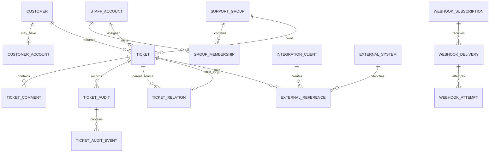

# Domain Model

## 1. Ubiquitous language

| Term | Meaning |
|---|---|
| Request | 고객 관점에서 보는 티켓의 공개 projection |
| Ticket | 상담 조직이 처리하는 업무 단위 |
| Customer | 문의한 사람의 프로필. 로그인 계정과 분리 |
| CustomerAccount | 검증된 인증 자격과 Customer 연결. MVP 이후 |
| StaffAccount | Agent, Admin, Security Auditor가 사용하는 직원 계정 |
| Agent | 티켓을 처리하는 직원 역할 |
| Admin | 계정·그룹·설정·외부 연동을 관리하는 역할 |
| Security Auditor | 티켓 수정권한 없이 감사 데이터를 조사하는 역할 |
| Group | 고객센터, 결제팀, 기술팀 같은 업무 조직 |
| Assignee | 현재 티켓을 직접 책임지는 한 명의 상담사 |
| Transfer | 기존 티켓의 그룹/담당자 소유권을 이동하는 행위 |
| Child ticket | 부모 소유권을 유지한 채 다른 내부 그룹에 위임한 별도 업무 |
| Public comment | 고객과 상담사 모두 볼 수 있는 대화 |
| Internal comment | 직원만 볼 수 있는 메모 |
| Ticket Audit | 한 번의 티켓 저장/업데이트를 나타내는 변경 묶음 |
| Ticket Audit Event | audit 안의 개별 필드 변경, 코멘트 생성 등 |
| Access Event | 사람이 어떤 민감 데이터·검색·export에 접근했는지 나타내는 기록 |
| Admin/Security Event | 계정·권한·설정·자격증명·감사 기능 사용 기록 |
| Audit Explorer | 서로 다른 감사 원장을 하나의 검색 화면에서 조회하는 read model |
| Integration Client | 외부 전산을 대표하는 machine identity |
| Integration Scope | 외부 client가 수행할 수 있는 세분화된 API 권한 |
| External System | 쇼핑몰, 주문, 결제, 운영 전산 같은 연결 대상 정의 |
| External Reference | Deskseed 객체와 외부 객체 ID·링크를 잇는 관계 |
| Webhook Subscription | 특정 integration event를 외부 endpoint에 전달하는 구독 |
| Delivery Attempt | webhook 한 번의 HTTP 전달 시도 |
| Trigger | 티켓 생성/변경 순간에 조건을 검사해 action을 수행하는 규칙 |
| Automation | 시간 경과를 기준으로 주기적으로 조건을 검사하는 규칙 |
| SLA Target | 특정 티켓에 적용된 응답/해결 시간 약속의 한 인스턴스 |

## 2. Actor model

모든 명령과 민감한 읽기는 명시적 actor를 가진다.

```text
Actor
  type: CUSTOMER | STAFF | INTEGRATION_CLIENT | TRIGGER | AUTOMATION | SYSTEM
  id
  displaySnapshot
  delegatedStaffId?     // later OAuth delegated grant only
  integrationClientId?
```

규칙:

- HTTP header 하나만으로 다른 상담사를 사칭할 수 없다.
- API key 호출의 기본 actor는 `INTEGRATION_CLIENT`다.
- 사람을 대신한 외부 호출은 나중에 OAuth delegated grant가 있을 때만 `delegatedStaffId`를 가진다.
- Trigger와 Automation은 definition ID와 version을 actor context에 포함한다.
- 표시 이름이 나중에 바뀌거나 계정이 삭제되어도 과거 감사 기록을 이해할 수 있도록 최소 display snapshot을 둔다.

## 3. Aggregate and ledger boundaries

### Ticket aggregate

Ticket이 책임지는 규칙:

- 현재 상태, 우선순위, 그룹, 담당자, 버전
- 공개/내부 코멘트 추가 명령의 유효성
- 담당자와 그룹 정합성
- 상태 전이
- 이관과 자식 티켓 생성의 구분
- 부모 해결 시 열린 자식 경고
- 변경 사실과 changed field set 생성

코멘트가 많아지면 aggregate를 매번 모두 로딩하지 않는다. 코멘트는 같은 bounded context의 append-only 엔티티로 저장하되, 생성 명령은 Ticket application service를 통과한다.

### Customer aggregate

- 익명 Customer는 이메일이 검증되지 않은 프로필이다.
- Customer와 인증 자격을 분리하여 나중에 계정·SSO·magic link를 추가한다.
- 같은 이메일을 입력했다는 이유만으로 기존 티켓 접근권한을 주지 않는다.
- 외부 회원 ID는 Customer 자체의 primary identity가 아니라 `ExternalIdentity` 또는 `ExternalReference`로 연결한다.

### Staff and Group aggregates

- StaffAccount와 SupportGroup은 별도 aggregate다.
- GroupMembership은 배정과 접근 정책에 사용된다.
- Security Auditor는 별도 read-only 역할이며 Agent 권한을 암묵적으로 얻지 않는다.

### Integration aggregates

#### IntegrationClient

```text
IntegrationClient
  id
  name
  status: ACTIVE | SUSPENDED | REVOKED
  scopes[]
  resourceConstraints
  credentialVersion
  expiresAt?
  lastUsedAt?
  createdBy
```

자격증명 원문은 한 번만 표시하며 DB에는 hash 또는 암호화된 필요한 부분만 저장한다.

#### ExternalSystem

```text
ExternalSystem
  id
  key                 // e.g. passorder-commerce
  displayName
  allowedLinkHosts[]
  active
```

#### ExternalReference

```text
ExternalReference
  id
  localResourceType: TICKET | CUSTOMER
  localResourceId
  externalSystemId
  externalObjectType: ORDER | PAYMENT | REFUND | USER | STORE | OPS_CASE | CUSTOM
  externalObjectId
  displayLabel?
  deepLinkUrl?
  metadataSnapshot?   // allowlisted, size-limited, non-authoritative
  createdAt
  createdByActor
```

외부 시스템이 source of truth다. `metadataSnapshot`은 화면 편의를 위한 제한된 복제이며 동기화 원장이 아니다.

#### WebhookSubscription and Delivery

```text
WebhookSubscription
  id, endpointUrl, eventTypes[], active
  secretVersion, timeout, retryPolicy

WebhookDelivery
  id, subscriptionId, eventId, status, createdAt

WebhookAttempt
  id, deliveryId, attemptNumber
  startedAt, completedAt, responseStatus, failureClass, nextAttemptAt
```

### Audit ledgers

감사 목적과 보존 정책이 다르므로 하나의 만능 테이블로 합치지 않는다.

1. `TicketAudit` + `TicketAuditEvent`: 티켓 업무 변경
2. `AccessAuditEvent`: ticket/customer/search/export/attachment 접근
3. `AdminSecurityAuditEvent`: 계정, 권한, 설정, 자격증명, 로그인, 감사 기능 사용
4. `IntegrationDeliveryLog`: webhook/exports 같은 전달 운영 기록
5. `AuditActivityProjection`: 위 원장을 합쳐 검색하는 재생성 가능한 read model

`AuditActivityProjection`은 원본이 아니다. 삭제해도 canonical ledgers에서 재구성할 수 있어야 한다.

## 4. Core invariants

### Ticket

1. 고객 문의 티켓은 생성 시 정확히 하나 이상의 `PUBLIC` 코멘트를 가진다.
2. Ticket 자체에는 `description`을 저장하지 않는다.
3. `INTERNAL` 코멘트는 customer projection에 들어갈 수 없다.
4. assignee가 있으면 group도 있어야 하고 assignee는 그 group의 활성 멤버여야 한다.
5. transfer는 기존 ticket ID와 number를 유지한다.
6. child creation은 parent의 group/assignee를 변경하지 않는다.
7. child ticket은 최대 하나의 직접 부모를 갖는다. 부모는 여러 자식을 가질 수 있다.
8. child ticket과 관계는 고객 API에 노출되지 않는다.
9. child solved는 parent solved를 자동 유발하지 않는다.
10. parent solved는 열린 child 때문에 막히지 않지만 경고를 반환한다.
11. 한 사용자 명령은 하나의 command ID를 가진다.
12. 한 command가 한 ticket을 변경하면 하나의 TicketAudit을 생성한다.
13. TicketAudit과 event는 수정·삭제할 수 없다.
14. 현재 Ticket row가 현재 상태의 source of truth다.
15. 자동화와 외부 API가 만든 변경도 같은 command와 audit pipeline을 통과한다.

### Integration

16. 모든 외부 요청은 IntegrationClient 또는 검증된 delegated human actor에 귀속된다.
17. 재시도 가능한 외부 write는 `Idempotency-Key` 없이 실행하지 않는다.
18. 같은 client·operation·key·payload 재시도는 같은 결과를 반환한다.
19. 같은 key를 다른 payload로 재사용하면 `409`다.
20. external reference의 외부 ID는 원문 문자열로 보존하되 정규화 규칙을 system별로 명시한다.
21. 외부 deep link는 `https`와 allowlisted host만 허용한다.
22. Deskseed 서버는 외부 reference URL을 기본적으로 fetch하지 않는다.
23. 외부 API와 내부 UI가 같은 업무를 수행하면 같은 application command를 호출한다.
24. 외부 network I/O는 ticket transaction 안에서 수행하지 않는다.
25. webhook은 적어도 한 번 전달될 수 있으므로 event ID가 안정적이어야 한다.

### Audit

26. 티켓 변경과 TicketAudit 저장은 같은 DB transaction에서 성공하거나 함께 실패한다.
27. staff의 민감한 상세 조회와 검색은 응답 전에 AccessAuditEvent를 영속화한다.
28. audit 저장에 실패한 민감한 read/write는 성공 응답을 반환하지 않는다.
29. 성공한 사용자 티켓 화면 열기는 하나의 semantic `TICKET_VIEWED` event를 만든다.
30. background refresh는 새 사용자 view로 위장하지 않는다.
31. 검색 실행은 query policy, filters, result count, search interaction ID를 기록한다.
32. 검색 결과에서 티켓을 열면 `originSearchEventId`로 연결한다.
33. 비밀번호, access token, API secret, authorization header는 감사 payload에 저장하지 않는다.
34. 감사 로그를 읽거나 export하거나 암호화된 검색어 원문을 공개한 행위도 감사한다.
35. app runtime DB role은 canonical audit row를 update/delete할 수 없다.
36. 보존 job도 actor, policy version, 범위, 삭제 건수와 결과를 남긴다.

## 5. Ticket and comment model

```text
Ticket #1042 — "결제가 되지 않아요"

1. CUSTOMER / PUBLIC
   카드 결제 버튼을 누르면 오류가 납니다.

2. AGENT / INTERNAL
   PG 거래 로그 확인을 결제팀에 요청함.

3. AGENT / PUBLIC
   확인 중이며 결과를 안내드리겠습니다.
```

제목은 티켓 속성이고 최초 본문은 첫 코멘트다. 장기적으로 rich text를 도입하더라도 원문 포맷, 안전하게 렌더링할 포맷, 검색용 plain text를 구분한다.

## 6. Transfer vs child-ticket delegation

```text
Transfer
Ticket #1042: 고객센터/A → 결제팀/B
ownership 자체가 이동
```

```text
Delegation
Parent #1042 remains 고객센터/A
Child #1043 assigned to 결제팀/B
B investigates internally; A communicates final answer to customer
```

둘을 하나의 assignment history로만 모델링하면 고객 응답 책임과 내부 협업 의미가 사라진다.

## 7. Ticket change audit model

```text
TicketAudit #901
commandId: cmd-...
actor: STAFF agent-A
source: AGENT_WORKSPACE
requestId: req-...
correlationId: corr-...
expectedVersion: 7
resultVersion: 8

Events:
  1 COMMENT_CREATED visibility=INTERNAL commentId=...
  2 GROUP_CHANGED old=customer-care new=payments
  3 ASSIGNEE_CHANGED old=agent-A new=agent-B
  4 STATUS_CHANGED old=NEW new=OPEN
```

필드 diff는 허용된 scalar/reference 타입으로 구조화한다. JPA entity 전체나 비정형 object dump를 저장하지 않는다.

코멘트 본문은 기본적으로 audit event에 중복 복사하지 않는다. `commentId`, visibility, author, content hash/length를 남기고, 권한 있는 Audit Explorer가 immutable comment를 별도로 조회한다. 향후 comment edit/redaction을 허용하면 version과 redaction event를 별도로 설계한다.

## 8. Access audit model

```text
AccessAuditEvent
  id
  occurredAt
  actor
  action: TICKET_VIEWED | SEARCH_EXECUTED | SEARCH_RESULT_OPENED | ...
  resourceType/resourceId/ticketNumber
  interactionId
  originSearchEventId?
  source
  ipAddress
  userAgent/clientId
  authType
  requestId/traceId
  outcome/httpStatus
  queryRedacted?
  queryFingerprint?
  encryptedRawQuery?
  filters?
  resultCount?
```

`TICKET_VIEWED`는 HTTP GET 횟수가 아니라 사용자가 티켓 화면을 연 의미적 행위다. 같은 화면의 polling/prefetch는 `interactionId`로 중복 view 생성을 막는다.

## 9. Conceptual relationship diagram


