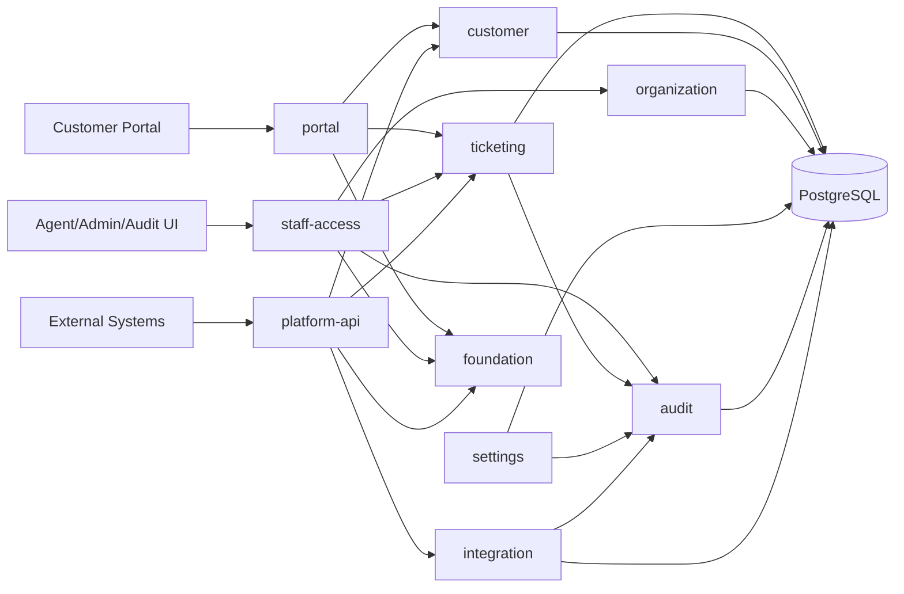

# Architecture

## 1. Architectural style

**Spring Modulith 기반 모듈러 모놀리스**다. 하나의 애플리케이션 프로세스와 하나의 PostgreSQL로 시작하지만, 도메인 모듈 API와 내부 구현 경계를 자동 검증한다.



모듈 이름은 구현 중 더 좋은 ubiquitous language가 나오면 ADR로 바꿀 수 있다. 중요한 것은 API surface와 데이터 책임의 분리다.

## 2. Module responsibilities

### `portal`

고객용 HTTP API, 익명 조회 token, 검증된 고객 projection을 담당한다. 고객에게 허용되는 공개 데이터의 최종 경계다.

### `staff-access`

Agent Workspace, Admin UI, Audit Explorer용 HTTP adapter를 담당한다. 직원 인증 context와 사용자 interaction metadata를 읽고 각 도메인 use case를 호출한다. 업무 규칙을 소유하지 않는다.

### `platform-api`

외부 시스템용 REST adapter다. API key/OAuth identity, scope, resource constraint, idempotency, rate limit, ETag/If-Match, Problem Details를 처리한 뒤 ticketing/customer/integration application service를 호출한다.

내부 staff controller를 그대로 공개하지 않는다. 같은 application command를 사용할 수 있지만 DTO, 권한, pagination, 안정성 계약은 별도다.

### `ticketing`

Ticket, Comment, TicketAudit, TicketRelation, 상태, 배정, 이관, 자식 티켓 규칙을 담당한다. 핵심 bounded context다.

### `customer`

Customer 프로필, 검증 상태, 향후 CustomerAccount와 external identity 연결을 담당한다.

### `organization`

StaffAccount, role, SupportGroup, GroupMembership과 조직 기반 권한 정보를 담당한다.

### `settings`

고객 접근 모드, 보존 정책, 보안 설정, 기능 flag처럼 관리자 정책을 중앙에서 해석한다. 설정 변경 사실은 audit 모듈에 기록한다.

### `audit`

다음을 소유한다.

- AccessAuditEvent
- AdminSecurityAuditEvent
- canonical audit append-only persistence policy
- AuditActivityProjection/query
- Audit Explorer authorization
- retention and integrity checkpoint metadata

TicketAudit은 ticketing이 업무 의미를 소유하지만, audit 모듈이 전역 projection과 보안 정책을 제공할 수 있다. 모듈 경계는 `TicketAuditRecorded` 같은 안정적 named interface/event로 연결한다.

### `integration`

다음을 소유한다.

- IntegrationClient and credentials
- scope/resource constraints
- ExternalSystem and ExternalReference
- idempotency records
- WebhookSubscription/Delivery/Attempt
- export jobs and manifests
- integration event envelope

### `foundation`

Clock, request/correlation/trace context, actor context, cryptography ports, structured error primitives처럼 제품 도메인이 아닌 좁은 기반만 제공한다. 범용 utils 저장소가 아니다.

## 3. Allowed dependencies

- 다른 모듈의 root API 또는 명시적 named interface만 import한다.
- 다른 모듈의 `internal` package import는 금지한다.
- `foundation`은 feature module을 import하지 않는다.
- JPA entity를 모듈 API나 HTTP 응답으로 노출하지 않는다.
- 모듈 간 데이터 결합은 stable ID, immutable DTO, domain event로 한다.
- `ApplicationModules.verify()`가 순환 의존성과 internal access를 검사한다.
- `platform-api`와 `staff-access`는 서로 import하지 않는다.
- `audit`가 ticketing entity를 직접 읽지 않고, 필요한 projection API나 event contract를 사용한다.

## 4. Layering inside a module

```text
<module>/
  public API types
  internal/
    domain/          business concepts and invariants
    application/     use cases and transaction orchestration
    infrastructure/  JPA/JDBC, crypto, external adapters
    web/             controller and HTTP DTO when owned by module
```

파일 수를 인위적으로 늘리지 않되, 변경 이유가 다른 코드를 같은 클래스에 몰아넣지 않는다.

## 5. Transaction and failure boundaries

### Business mutations

- 외부에서 보이는 하나의 명령은 application service의 하나의 transaction에서 시작한다.
- ticket current state, comment, TicketAudit, ordered audit events는 함께 commit한다.
- audit write가 실패하면 ticket mutation도 rollback한다.
- 외부 HTTP, email, webhook, Kafka publish를 DB transaction 안에서 실행하지 않는다.
- delivery intent/outbox만 transaction에 기록하고 실제 network I/O는 commit 이후 수행한다.

### Sensitive reads and searches

- authorization, data query, AccessAuditEvent insert가 하나의 request use case 안에서 완료된 뒤 응답한다.
- 초기 single-DB 구현에서는 access audit insert 실패 시 성공 response를 반환하지 않는 `STRICT` semantics를 사용한다.
- low-level health check, static asset, public documentation은 access audit 대상이 아니다.
- staff ticket detail, customer profile, search, attachment, export, audit explorer는 대상이다.

### Webhook and export

- event creation과 delivery intent는 business commit 이후 또는 같은 transaction의 outbox로 기록한다.
- 외부 endpoint 응답은 business transaction 결과를 바꾸지 않는다.
- retry와 duplicate delivery는 정상 상태다.
- manual replay는 새 business event가 아니라 같은 event의 새 attempt다.

## 6. Event strategy

### Stage 1 — in-process facts

```text
Ticket command
  → current state + ticket audit commit
  → immutable domain fact
  → local listener updates audit projection or creates delivery intent
```

### Stage 2 — durable local publication

실패 복구가 필요한 listener가 생기면 Spring Modulith Event Publication Registry 또는 명시적 outbox를 사용한다.

### Stage 3 — externalized integration events

독립 소비자나 처리량 요구가 생기면 versioned integration event를 Kafka로 외부화한다.

Domain event와 integration event는 같은 클래스가 아니다. integration event는 공개 가능한 정보만 가진 별도 버전 계약이다.

## 7. API surfaces

```text
/api/v1/requests/**          Customer portal
/api/v1/agent/**             Agent workspace
/api/v1/admin/**             Admin management
/api/v1/audit/**             Security Auditor
/api/v1/platform/**          External machine clients
/api/v1/integration-hooks/** Provider-specific inbound hooks, later
```

- 각 surface는 별도 auth policy와 projection을 가진다.
- 내부 JPA model이나 internal API를 공개 surface로 재사용하지 않는다.
- Platform API는 OpenAPI 3.1을 source of truth로 하며 generated SDK가 이를 따른다.
- 오류는 RFC 9457 Problem Details를 사용한다.

## 8. App and embed extension architecture

### Phase 1 — deep link and external reference

Agent Workspace sidebar에서 주문·회원·결제 객체의 label과 안전한 deep link를 표시한다. 가장 단순하고 실패 영역이 작다.

### Phase 2 — sandboxed Agent App SDK

외부 또는 자체 앱을 iframe sandbox에서 실행한다.

```text
App manifest
  locations: ticket_sidebar | customer_sidebar | top_bar
  requestedScopes
  allowedOrigins
  entryUrl
```

Host bridge는 제한된 기능만 제공한다.

```text
context.get()
events.subscribe()
actions.invoke()
http.request()    // server-side proxy and allowlist
```

브라우저에 long-lived integration secret를 주지 않는다. host와 app 사이 `postMessage`는 정확한 origin과 session nonce를 검증한다.

### Phase 3 — Embed SDK for internal admin systems

쇼핑몰/운영 어드민에 티켓 패널을 넣을 때 외부 backend가 short-lived signed embed token을 발급하고, browser에는 장기 API key를 두지 않는다. 첫 구현은 full ticket editor보다 create/list/detail read panel로 제한한다.

## 9. Read/write model evolution

1. PostgreSQL indexed transactional query
2. Audit Explorer용 union/read projection
3. Ticket queue와 검색에 필요한 전용 projection
4. PostgreSQL full-text search
5. Materialized views and analytics schema
6. measured limitation 이후 Elasticsearch/ClickHouse/warehouse

CQRS는 이름만 나눈 클래스가 아니라 서로 다른 read model과 consistency cost가 실제로 필요할 때 도입한다.

## 10. Security architecture

### Customer

익명 request token은 고엔트로피 opaque token이며 hash만 저장한다. 이후 이메일 검증, magic link, HttpOnly session, CustomerAccount로 확장한다.

### Staff

Spring Security 기반 session을 기본으로 시작한다. Admin과 Security Auditor는 더 강한 인증 정책과 향후 MFA/SSO를 적용할 수 있어야 한다.

### Integration clients

첫 버전은 scoped API key다.

- secret once display
- hash at rest
- expiry, revoke, rotate with overlap
- scope and resource constraints
- last-used metadata
- optional IP allowlist

향후 OAuth 2.0 client credentials와 authorization code + PKCE를 추가한다. 임의 header staff impersonation은 금지한다.

### Authorization

```text
Authentication
  → ActorContext
  → Scope/Role/Relationship Policy
  → Use Case
  → Repository
  → Audit obligation
```

Controller annotation만으로 끝내지 않는다.

## 11. Audit integrity architecture

- migration owner와 runtime role을 분리한다.
- runtime app role은 canonical audit table에 INSERT/SELECT만 가능하고 UPDATE/DELETE는 불가하다.
- DB trigger/privilege test로 변조 시도를 거부한다.
- 모든 audit event에 stable ID, timestamp, actor, request ID, source, outcome을 둔다.
- 일별 ordered digest와 signed checkpoint를 생성하는 기능을 post-MVP에 추가한다.
- checkpoint를 외부 object storage/SIEM/WORM 성격의 저장소로 보내면 DB 관리자 수준 삭제도 탐지할 수 있다.
- 감사 로그 조회와 export를 별도 `AUDIT_LOG_VIEWED`, `AUDIT_EXPORT_*` event로 남긴다.

## 12. Observability vs audit

운영 로그와 감사 원장은 다르다.

| Operational telemetry | Audit data |
|---|---|
| 오류, latency, trace, health | 누가 어떤 업무 데이터에 무엇을 했는지 |
| 상대적으로 짧은 보존 | 정책별 장기 보존 |
| body와 secret를 남기지 않음 | 구조화된 actor/resource/action/outcome |
| 삭제·sampling 가능 | canonical record는 append-only |
| 장애 진단 목적 | 보안·내부 감사·업무 설명 목적 |

한쪽을 다른 쪽의 대체물로 사용하지 않는다.

## 13. Deployment

현재는 Docker Compose로 PostgreSQL, backend, frontend를 실행한다. self-hosted 운영 문서에는 backup/restore, migration, credential rotation, retention, audit archive, upgrade compatibility가 필요하다.

Kubernetes는 설치 규모와 운영 요구가 증명되기 전까지 제품 의존사항이 아니다.
