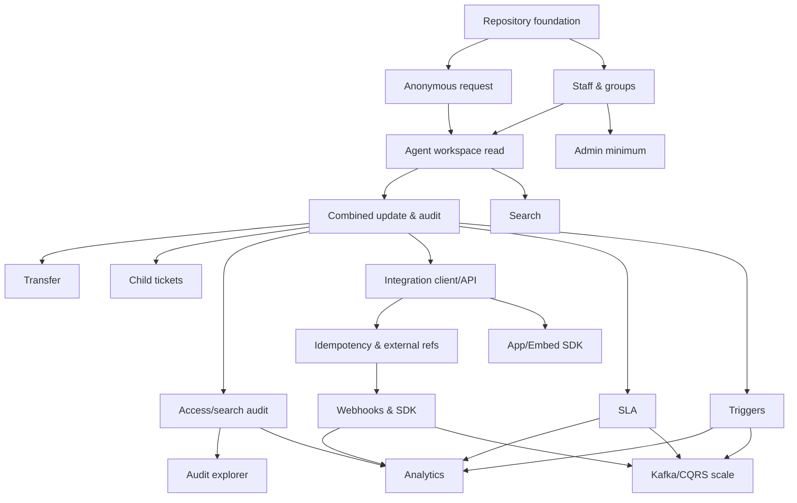

# Feature Implementation Dependency Map

## 1. 핵심 의존 그래프



## 2. Feature gates

| Feature | 반드시 먼저 필요한 것 |
|---|---|
| Views | ticket read model, staff/group auth |
| Combined submit | versioning, audit schema, permission service |
| Child tickets | relation model, parent read permission |
| Audit explorer | canonical ticket audit + access audit |
| Platform API | shared application commands + actor context |
| Webhooks | integration event envelope + outbox |
| SLA | stable event semantics + deterministic clock |
| Analytics | metric glossary + update facts/snapshots |
| Trigger | command catalog + audit/source/correlation |
| Search audit | search session and semantic ticket view |
| Elasticsearch | rebuildable projection + measured need |
| Kafka | outbox/event versioning + durable consumers |

## 3. 병렬화 가능한 작업

- Backend core와 frontend design system shell.
- Staff/group auth와 customer portal shell.
- OpenAPI schemas와 mock UI.
- audit explorer UI는 mock data로 R1과 병렬 가능.
- Integration UI는 platform contract가 동결된 뒤 mock 가능.

## 4. 병렬화하면 안 되는 작업

- UI가 임의 endpoint를 먼저 만들고 backend 의미를 맞추는 방식.
- SLA 계산 전에 status event semantics가 흔들리는 상태.
- Analytics 전에 metric glossary 승인 없이 SQL 작성.
- Kafka consumer 전에 integration event version이 없는 상태.

## 5. 권장 포트폴리오 태그

```text
v0.1-anonymous-request
v0.2-agent-workspace
v0.3-audit-concurrency
v0.4-transfer-child
v0.6-security-audit
v0.6-integration-api
v0.7-sla-analytics
v0.8-automation-search
v1.0-portfolio-stable
```
