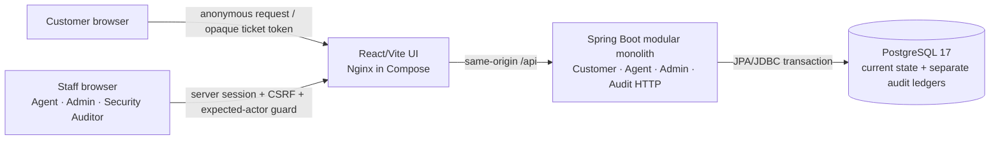
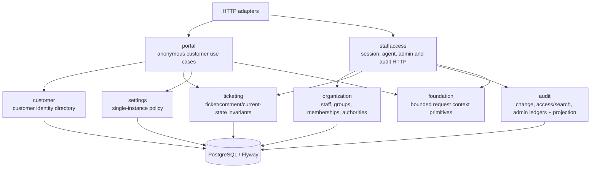
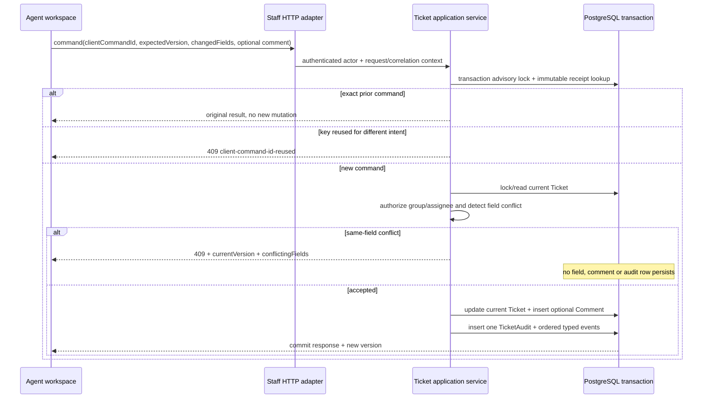
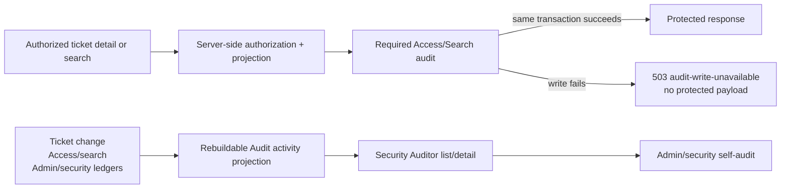

# Current Release Architecture

This document describes the code that exists in the portfolio release. The broader
product blueprints in `docs/03-architecture.md` include future modules; they must not be
read as an implementation claim.

## System context

The supported topology is one Docker Compose installation for one organization. There is
no Kafka, Redis, Elasticsearch, Kubernetes, external identity provider, object store or
email provider in the current runtime.

## Implemented application surfaces

| Surface | Routes / responsibility | Status |
|---|---|---|
| Customer portal | request create, token lookup, PUBLIC-only conversation | Implemented |
| Agent workspace | session login, views/search, ticket detail, PUBLIC/INTERNAL command, conflict, transfer, child | Implemented |
| Admin | staff, group and active membership administration | Implemented |
| Audit Explorer | unified ledger list/detail, search-query reveal, export-request skeleton, projection rebuild | Implemented with the limitations below |
| Platform API / SDK / webhook | separate future contract only | Not implemented |
| Customer accounts / magic links | accepted design only | Not implemented |
| SLA / trigger / analytics / email / attachment | detailed future specifications | Not implemented |

Audit export currently records an allowlisted request and self-audit with artifact state
`NOT_CREATED`. It does not generate, download, expire or delete an artifact. Protected
comment reveal is not implemented.

## Backend module boundary

The source root contains eight Spring Modulith modules. Controllers translate HTTP;
application services own transactions; domain types own invariants; internal persistence
adapters own I/O. `ArchitectureTest` runs `ApplicationModules.verify()` to guard cycles and
illegal internal cross-imports.

Arrows show the main request collaboration, not permission to import another module's
`internal` package. Named/root module interfaces remain the code-level contract.

## Core command and audit data flow

The current `tickets` row is the current-state source of truth. Audit is append-only
history, not an Event Sourcing state store. A required audit insert failure rolls back the
command.

## Sensitive-read and Audit Explorer flow

Customer lookup uses a separate token-bound projection and returns only PUBLIC comments.
It never serializes INTERNAL comments, child relations, staff-only ownership fields or
audit metadata.

## Persistence and operational boundary

- Flyway owns schema changes; Hibernate is `validate` only.
- Production configuration accepts separate migration and runtime database credentials.
- `scripts/postgres/configure-runtime-role.sql` removes DDL and canonical-ledger
  update/delete privileges from the general runtime role; triggers remain defence in depth.
- Canonical ledgers are `ticket_audits`/events, `access_audit_events` with immutable search
  detail/result rows, and `admin_security_audit_events`.
- `audit_activity_projection` is rebuildable and therefore not canonical.
- Search-query ciphertext is authenticated, versioned and retention-deletable; the keyed
  fingerprint supports equality without exposing the exact query.
- A PostgreSQL owner/superuser can still bypass ordinary grants. Independent signed
  checkpoints or external immutable storage are future tamper-evidence work, not a claim
  of this release.

## Evidence and decision links

- [ADR index](adr-index.md)
- [Release verification](../evidence/release/verification-summary.md)
- [Operations runbook](../36-self-hosted-operations-runbook.md)
- [Minimum verification gates](../21-minimum-verification-gates.md)
- [Release task brief](../../tasks/briefs/release-hardening.md)
